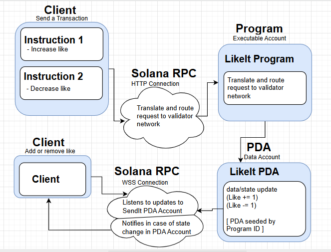

# Likeit-Solana 

Likeit  is a peer feedback system built on Solana where developers submit projects (project name and project URL), and users can like or dislike them. Feedback is stored on-chain in a public, transparent account, allowing anyone to view likes and dislikes. This ensures developers receive visible, immutable feedback on their respective projects.

## User Story

As a developer, I want to submit my project and receive likes or dislikes on-chain, so that I can gain feedback visible to everyone.
As a User, I want to like or dislike a project so that I can give valuable feedback
As a developer, I want to be able to view total like count so that I can know how good my project is


### Acceptance Criteria

- Project feedback is stored in a public Solana account.

- Users can send transactions to like or dislike a project.

- Anyone can view the current counts of likes and dislikes.

## Architectural Diagram



## Setup and Running

### Prerequisites

- Rust

- Solana CLI

- Anchor CLI

- Node.js

- Yarn

### Installation

1. Clone the repository:
```bash
git clone https://github.com/Skidam/likeit-solana
```

2. Install Node dependencies:
```bash
yarn install
```

### Build
```bash
anchor build
```

### Deploy to devnet
```bash
anchor deploy 
```

### Run Test
```bash
anchor test
```
